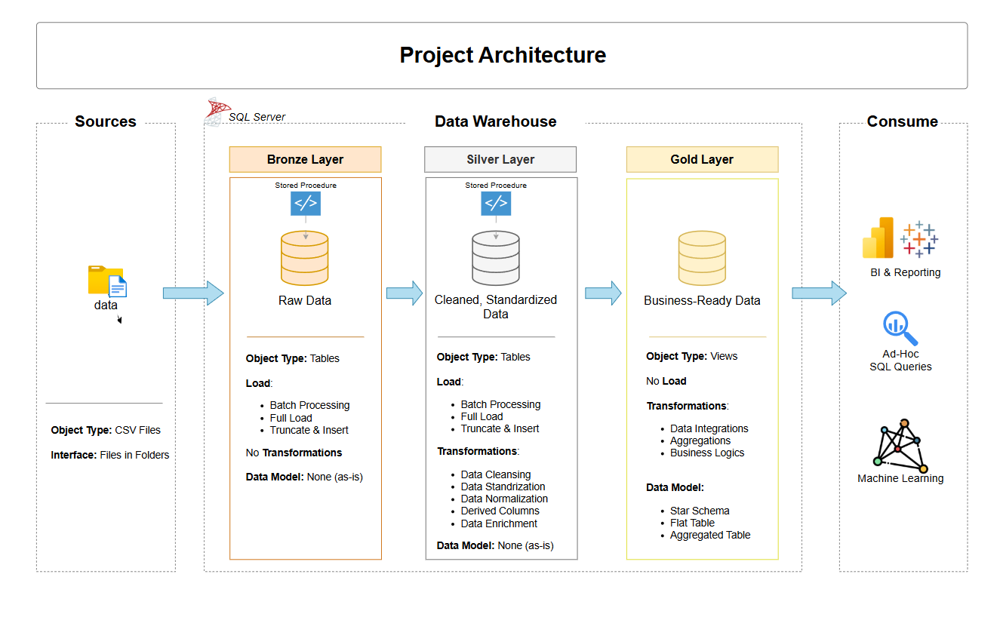
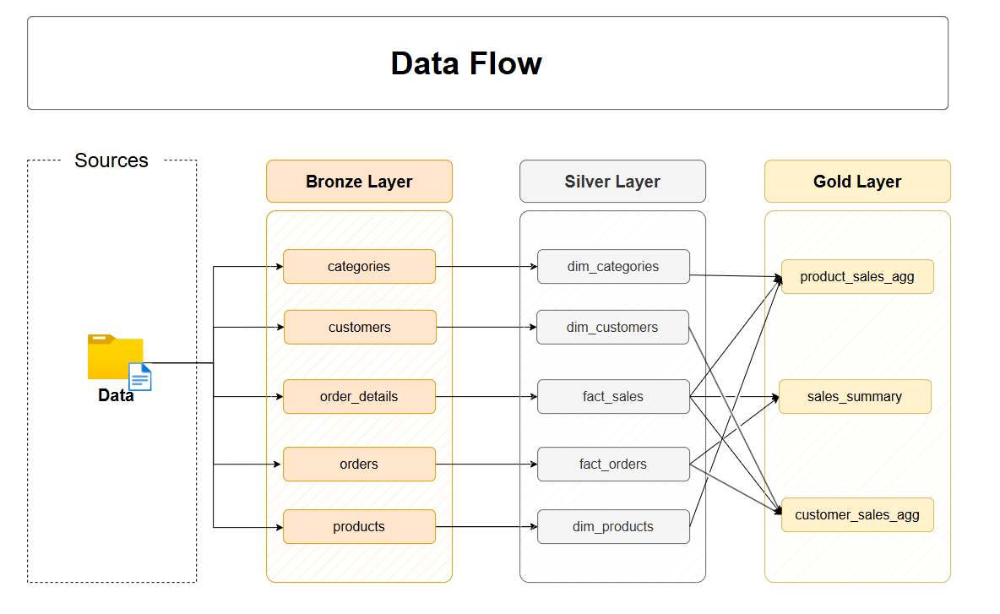

# 🚀 Data Warehouse Project

## 📌 Overview
This project implements a **Modern Data Warehouse** using the **Medallion Architecture** (**Bronze → Silver → Gold** layers) in **SQL Server**.  
It covers the full pipeline — from **raw data ingestion** to **business-ready analytics**.

---

## 🏗️ Data Architecture

We follow the **Medallion Architecture**:

- **Bronze Layer (Raw)**  
  - Stores **raw data** from source systems (CSV files).  
  - No transformations applied — data is stored **as-is**.  
  - Acts as an immutable source of truth.

- **Silver Layer (Cleaned & Standardized)**  
  - Cleanses, standardizes, and enriches data.  
  - Handles missing values, data type conversions, and standard formats.  
  - Prepares datasets for analytical modeling.

- **Gold Layer (Business-Ready)**  
  - Contains **star schema** design (fact & dimension tables).  
  - Optimized for reporting and dashboards.  
  - Joins and transformations are already performed.

---

## 📖 Project Workflow

1. **Data Ingestion (Bronze Layer)**  
   - CSV datasets (`categories.csv`, `customers.csv`, `orders.csv`, etc.) are loaded into **Bronze tables**.

2. **Data Transformation (Silver Layer)**  
   - SQL scripts clean and standardize Bronze data.
   - Creates **fact** and **dimension**-ready datasets.

3. **Data Modeling (Gold Layer)**  
   - Builds **fact** and **dimension** tables (star schema).
   - Example: `fact_sales`, `dim_customers`, `dim_products`.

4. **Reporting & Analytics**  
   - SQL reports for sales, customer analytics, and product performance.
   - Can integrate with Power BI/Tableau for dashboards.

---

## 🖼️ Project Architecture

---

## 🔄 Data Flow

---

## 📂 Repository Structure

data_warehouse_project/
│
├── datasets/
│   ├── categories.csv
│   ├── customers.csv
│   ├── order_details.csv
│   ├── orders.csv
│   └── products.csv
│
├── scripts/
│   ├── bronze_layer/
│   │   ├── ddl_bronze.sql
│   │   └── proc_load_bronze.sql
│   ├── silver_layer/
│   │   ├── ddl_silver.sql
│   │   └── proc_load_silver.sql
│   └── gold_layer/
│       └── ddl_gold.sql
│
├── Files/
│   ├── data_flow.png
│   └── project_architecture.png
│
└── README.md
